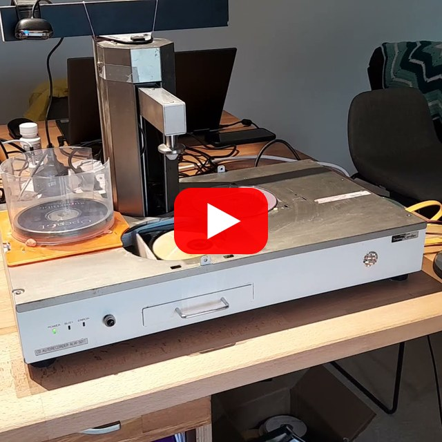
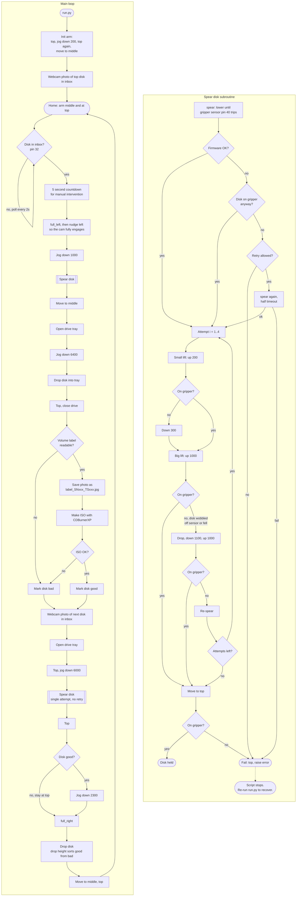
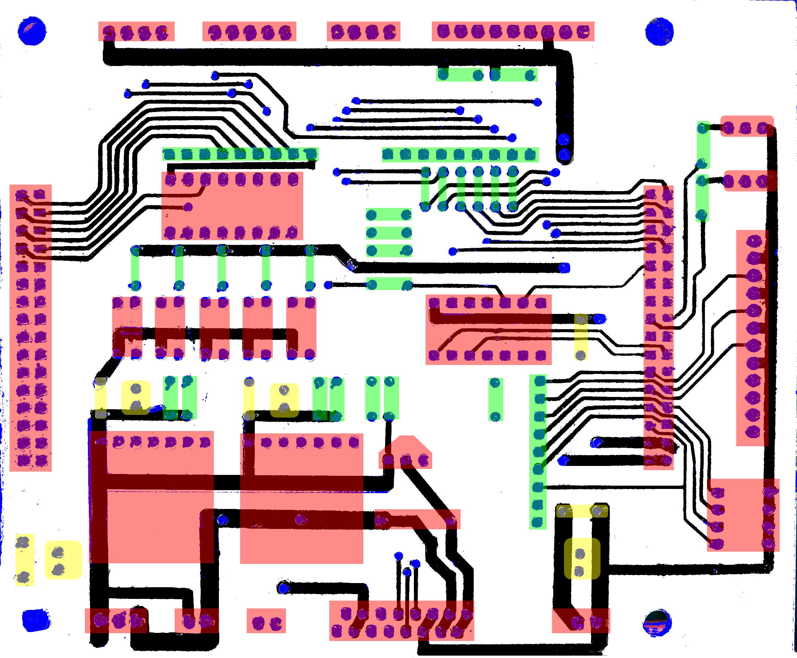
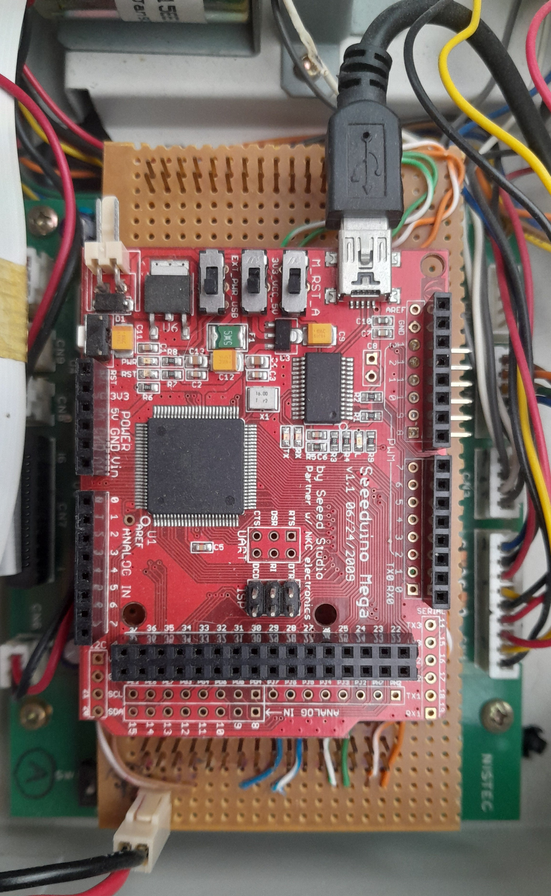
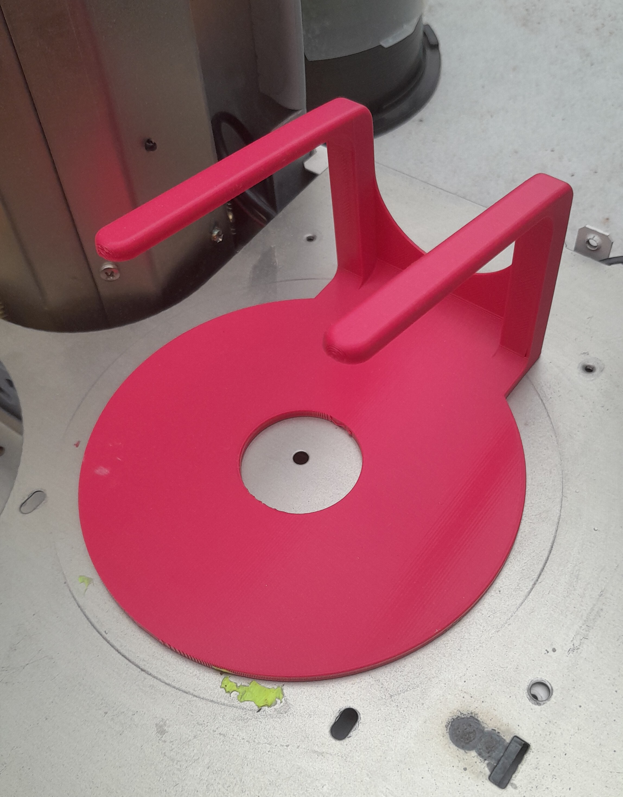

<div align="center">

# CD Changer Robot

**A Nistec ALW-501 optical disk robot, I modernised and rebuilt as a bulk CD ripper.**

[](LICENSE.txt)
[](#project-status)
[](runner/)
[](firmware_megaatmega1280/)
[](https://platformio.org/)
[](runner/cd_drive.py)
[](https://github.com/busyDuckman/cd_changer_robot/commits/main)

I bought this robot ina "parts only" condition of eBay for $50. It was a seriously well built bit of kit and worth the restore. I hope this repo may save someone else a heap of work.
  
[](https://youtube.com/shorts/DimQMZp4Gug)

*Click to watch it in action on YouTube.*

</div>

---

## About

I would routinely backup files to optical disk and toss them into a silo. One day I needed some old files and realised my computer does not
even have a CD drive anymore. A thousand odd backup disks were degrading, so I did the only reasonable thing I knew how, I built a robot. 

The first version was a home made arm, that worked, but did not have the reliability to scale. I saw that old CD burning robots were cheap and grabbed a Nistec ALW-501 of ebay. 

The original mobo on the unit appeared cooked and would not respond to commands. So I ditched it and reverse engineered the motor driver board. Then built a new mobo using an arduino, some Veroboard, and a few matching connectors. Then set up a python harness to run the thing from a PC.

The robot has done its job and is being mothballed. This repo is here for anyone who wants to try a similar project, or who ends up inheriting the robot.

**Note:** It's not shown in the video, but I added a 3d printable part a "CD sorter". using this The drop height at the done pile can be used to determine which of two piles a disk ends up in. The system is configured to use it, but if it is not present, then you just get one pile. 

> [!TIP]
> **Free to good home!** Do you know a good home for this device? A public library that wants to move its CD collection to cloud storage would be ideal.


Features:
  - Using an arduino to replace the existing motherboard.
  - Python script rips disks to .iso images using CDBurnerXP or Anyburn
  - Takes photos of disks before ripping using a webcam.
  - Places bad rips into a separate pile for data recovery.


## Repository layout

| Path | Contents |
| --- | --- |
| [runner/](runner/) | Python control script. Talks to the firmware over a USB serial port, runs the CD drive, and takes photos. |
| [firmware_megaatmega1280/](firmware_megaatmega1280/) | Arduino firmware (PlatformIO project) for the new motherboard. |
| [nistec_ALW_501/](nistec_ALW_501/) | Reverse-engineering notes: pin map, a traced driver-board circuit, and datasheets for its chips. |
| [3d_printed_new_parts/](3d_printed_new_parts/) | Some new parts were needed: Cable guard, CD sorter (reject chute), and a shim for the Lite-On drive. |
| [laser_cut_parts/](laser_cut_parts/) | My robot was missing the silo for the disks. This adapter (.dxf) lets you place a regular disk bin in the exact right spot.|
| [docs/](docs/) | Reference assembly images. |

## How it works




## Controller Circuit

I used a Seeduino mega v1.1, and connected the IO via the dual row header


### Pin mapping: Arduino Mega to original driver board

The Arduino I/O pins are wired to the driver board as per:


| Pin | Function | Firmware name |
| :---: | --- | --- |
| 23 | Front panel **ERROR** light | ERROR_LIGHT_PIN |
| 24 | Arm motor **up** | ARM_UP_PIN |
| 25 | Arm motor **left** | ARM_LEFT_PIN |
| 26 | Front panel **BUSY** light | BUSY_LIGHT_PIN |
| 27 | **Gripper** (LOW = grip, HIGH = release) | GRIPPER_PIN |
| 28 | Arm motor **down** | ARM_DOWN_PIN |
| 29 | Arm motor **right** | ARM_RIGHT_PIN |

**Notes:**  
  - Each motor axis has a pair of direction pins connected to a H-bridge on the driver board, best not drive both pins high at the same time :)
  - All sensor inputs are active low.
  - Pickup works 80% of the time, so you need to check the gripper worked via the sensor and repeat the pickup process if it fails.

### Inputs (driver board to Mega)

| Pin | Function | Used in code as |
| :---: | --- | --- |
| 30 | Doors are open | *(read, not used)* |
| 31 | Right disk switch | *(read, not used)* |
| 32 | Left disk optical sensor: disk present in inbox | cd_storage_sensor_pin |
| 33 | Arm vertical **top** limit | ARM_VERTICAL_STOP_INDEX |
| 38 | Left disk switch | *(read, not used)* |
| 39 | Rotary cam pulse: arm in **middle** position | ARM_MIDDLE_SENSOR_INDEX / middle_sensor_pin |
| 40 | **Disk on gripper** | GRIP_SENSOR_PIN / cd_gripper_pin |
| 41 | Tower/arm at **right** | ARM_RIGHT_SENSOR_INDEX / right_sensor_pin |
| 42 | Arm vertical encoder ticks (used for distance) | ARM_VERTICAL_TICK_INDEX |
| 44 | Tower/arm at **left** | ARM_LEFT_SENSOR_INDEX / left_sensor_pin |
| 47 | CD dropped | *(read, not used)* |

The firmware polls pins 30-33 and 38-53 every 500 us on a timer interrupt and counts transitions on each one. You can see the live state of all of them with the who command or run.py --mode test_pins.

> [!NOTE]
> Still unknown: pin **22** and pin **46**. My unit had some damage, perhaps someone with an intact machine will find out whats up.

### Driver board reference

[nistec_ALW_501/](nistec_ALW_501/) has a diagram of top and bottom traces on the OEM driver board ([reversed_driver_circuit.png](nistec_ALW_501/reversed_driver_circuit.png)), a matching photo of the PCB that it can overlay on. It also holds datasheets for the main components.

<a href="nistec_ALW_501/reversed_driver_circuit.png"></a>

[docs/arduino_harness_and_assembly/](docs/arduino_harness_and_assembly) has reference images of the new controller board and its assembly and connection.

<a href="docs/arduino_harness_and_assembly/arduino_on_harness.jpg"></a>

docs\arduino_harness_and_assembly\arduino_on_harness.jpg


## Firmware control commands

The new firmware (what I added, not the original unit) uses 9600 baud, newline-terminated text commands. 
Every command returns either '_OK_' or '_FAIL_' when done. Before that arrives diagnostic output is  returned, always starting with 'info:' or 'error:'.

| Command | Action |
| --- | --- |
| help | List commands |
| grip / release | Close / open the gripper |
| drop | Release for 500 ms, then grip again |
| left / right | Jog the arm sideways for 500 ms |
| full_left / full_right | Move the arm until the left/right limit triggers |
| left_to_middle / right_to_middle | Move the arm until the middle sensor triggers |
| up / down | Jog the arm vertically by set_v_dist encoder ticks |
| set_v_dist <n> | Set the vertical jog distance |
| top | Raise the arm until the top limit triggers |
| spear | Lower the arm until a disk is detected on the gripper |
| who [pin] | Print state and transition count for all pins, or for one pin |

## Getting started

### 1. Flash the firmware

The firmware is a [PlatformIO](https://platformio.org/) project for an Arduino Mega 1280. It needs the **TimerOne** and **digitalWriteFast** libraries, which are bundled in [required_libraries.rar](firmware_megaatmega1280/required_libraries.rar).

```bash
cd firmware_megaatmega1280
pio run --target upload
```

### 2. Set up the runner

```bash
cd runner
pip install -r requirements.txt
```

You also need **Windows**, because ISO creation shells out to Windows tools. Robot control and the camera also work on Linux. Install [CDBurnerXP](https://cdburnerxp.se/) (the default) or [AnyBurn](https://www.anyburn.com/) in its standard location under `C:\Program Files\`.

### 3. Run it

The script scans COM ports to find the robot, and uses the first CD drive and the last webcam it finds.

```bash
python run.py                                  # rip everything in the inbox
python run.py --iso_file_path D:\rips          # choose where ISOs go (default C:\share\cd_robot)
python run.py --mode home                      # return the arm to the home position
python run.py --mode test_pins                 # watch sensor states live
```

There are also `calibrate_load`, `calibrate_unload` and `calibrate_store_low` modes for tuning the vertical travel distances.

See [runner/README.md](runner/README.md) for more detail.

## The CD sorter

This nifty device gives you a extra end bay for free. Disks released above it slide away to a box you can store behind the machine. 

<a href="docs/cd_sorter.jpg"></a>

## Project status

**Mothballed.** The robot has done the job it was built for. The code was *"unapologetically written in a hurry"*, because if I had spent too long on it, I might as well have copied the disks by hand. Expect rough edges, hard-coded paths, etc.

Issues and forks are welcome if you're building something similar.

## License

Released under the [MIT License](LICENSE.txt).
